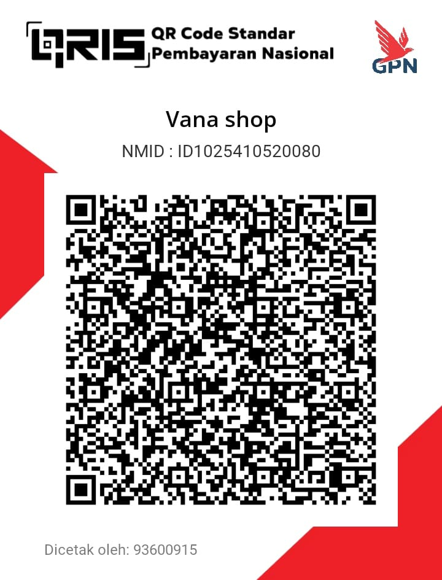

```markdown
<div align="center">
  

  # 🚀 SKY BOT WHATSAPP
  
  <a href="https://git.io/typing-svg">
    
  </a>

  <p align="center">
    <a href="#">
      
    </a>
    <a href="#">
      
    </a>
    <a href="#">
      
    </a>
    <a href="#">
      
    </a>
  </p>
  
  <p align="center">
    <strong>Bot WhatsApp Multi-Device canggih dengan fitur melimpah untuk kebutuhan grup dan personal Anda.</strong>
  </p>
  
  <p align="center">
    <a href="#installation">Installation</a> •
    <a href="#features">Features</a> •
    <a href="#configuration">Config</a> •
    <a href="#donate">Donate</a>
  </p>
</div>

---

## 🌟 Tentang Project
Project ini adalah implementasi bot WhatsApp menggunakan library **@adiwajshing/baileys**. Dikembangkan dengan fokus pada performa yang cepat, fitur yang stabil, dan kemudahan penggunaan. Bot ini sangat cocok untuk manajemen grup, hiburan (games), dan tools produktivitas.

> **Project Owner**: IzharDevelop

---

## ⚡ Features (Fitur Unggulan)

Klik panah di bawah untuk melihat detail fitur.

<details>
<summary><strong>🎮 Games & Fun</strong></summary>
<br>

* ❌⭕ **TicTacToe** - Main XOXO lawan teman/bot.
* 🔢 **Math Game** - Asah otak matematika.
* ✊✋✌️ **Suit PvP** - Suit klasik lawan member lain.
* 🎭 **Tebak-tebakan** - Tebak Gambar, Kata, dll.
* 🎰 **Casino & RPG** - (Coming Soon).

</details>

<details>
<summary><strong>🛠 Tools & Converter</strong></summary>
<br>

* 🖼️ **Sticker Maker** - Ubah Gambar/Video/Gif jadi stiker.
* 🏷️ **Sticker Exif/WM** - Ganti author pack stiker.
* 🗣️ **Text to Speech (TTS)** - Ubah teks jadi suara Google.
* 📝 **Nulis Bot** - Membuat tulisan tangan otomatis di buku/folio.
* 🔄 **Image Converter** - Resize, to JPG, to PNG.

</details>

<details>
<summary><strong>🔍 Search & Downloader</strong></summary>
<br>

* 🎨 **Pixiv Search** - Cari gambar anime.
* 📺 **YouTube Downloader** - MP3 & MP4.
* 🎵 **TikTok Downloader** - No Watermark.
* 📷 **Instagram Downloader** - Post/Reels/Story.
* 🌐 **Web Scraper** - Cari informasi dari Google/Wikipedia.

</details>

<details>
<summary><strong>🛡 Group Management</strong></summary>
<br>

* 🚫 **Anti-Spam** - Auto block spammer.
* 🔗 **Anti-Link** - Auto kick pengirim link grup lain.
* 👋 **Welcome/Leave** - Sapa member baru/keluar.
* ⚙️ **Group Settings** - Open/Close grup otomatis.
* 👻 **Hidetag** - Tag semua member tanpa terlihat.

</details>

<details>
<summary><strong>🤖 Advanced Features</strong></summary>
<br>

* 📱 **Jadibot (Numpang)** - User bisa numpang jadi bot.
* 💾 **Database Support** - Menyimpan data user & grup.
* 🔄 **Auto Restart** - Jika bot error/berat (via PM2/Nodemon).
* 📁 **File Uploader** - Upload file ke server sementara.

</details>

---

## 🛠 Installation (Instalasi)

Ikuti langkah-langkah berikut untuk menjalankan bot ini di komputer atau server kamu (VPS/RDP).

### 1. Persyaratan (Requirements)
Pastikan kamu sudah menginstall:
* [Node.js](https://nodejs.org/en/) (Disarankan versi 16.x atau terbaru)
* [FFmpeg](https://ffmpeg.org/) (Wajib untuk fitur stiker & media)
* [Git](https://git-scm.com/)

### 2. Clone & Install
Buka terminal/command prompt dan jalankan perintah:

```bash
# Clone repository ini
git clone [https://github.com/izhardevelop/sky.git](https://github.com/izhardevelop/sky.git)

# Masuk ke folder
cd sky

# Install dependency
npm install

# (Opsional) Jika menggunakan Linux/Termux, bisa pakai script otomatis:
bash install.sh

```

### 3. Konfigurasi

Sebelum menjalankan, edit file `settings.js` untuk menyesuaikan data owner.

```javascript
// settings.js
global.owner = ['628xxxxxxxx'] // Ganti dengan nomor kamu
global.botname = 'Sky Bot'
global.packname = 'Sticker By'
global.author = 'Sky Bot'
// ... dst

```

### 4. Jalankan Bot

Ada beberapa cara untuk menjalankan bot:

```bash
# Cara Basic
node index.js

# Menggunakan Nodemon (Auto-restart saat edit file)
npm start

# Menggunakan PM2 (Disarankan untuk VPS - jalan di background)
pm2 start index.js --name "skybot"

```

---

## 📂 Struktur File

Gambaran singkat struktur folder project ini:

```
sky/
├── 📂 lib/           # Core Functions (Game, Scraper, Tools)
│   ├── converter.js
│   ├── game.js
│   ├── pixiv.js
│   └── ...
├── 📂 src/           # Database & Assets
│   ├── 📂 media/     # Gambar/Logo (naze.png, qris.jpg)
│   ├── 📂 nulis/     # Font & Background nulis
│   ├── jadibot.js
│   └── ...
├── 📄 index.js       # Main Entry Point
├── 📄 settings.js    # Konfigurasi User
├── 📄 install.sh     # Auto Install Script
└── ...

```

---

## 🤝 Kontribusi & Credits

Terima kasih kepada para developer library open source:

* **IzharDevelop** (Creator & Developer)
* [`@adiwajshing/baileys`](https://www.google.com/search?q=https://github.com/adiwajshing/baileys) (WhatsApp Web API)
* Dan kontributor lainnya.

---

## 💸 Donasi

Jika kamu merasa bot ini bermanfaat, dukung pengembangan bot ini dengan berdonasi seikhlasnya agar server tetap hidup.

<div align="center">



<p><strong>Scan QRIS di atas untuk berdonasi via All E-Wallet / Bank.</strong></p>
</div>

---

<div align="center">
<p>Made with ❤️ by <strong>IzharDevelop</strong></p>
<p>© 2024 Sky Bot. All Rights Reserved.</p>
</div>

```

```
